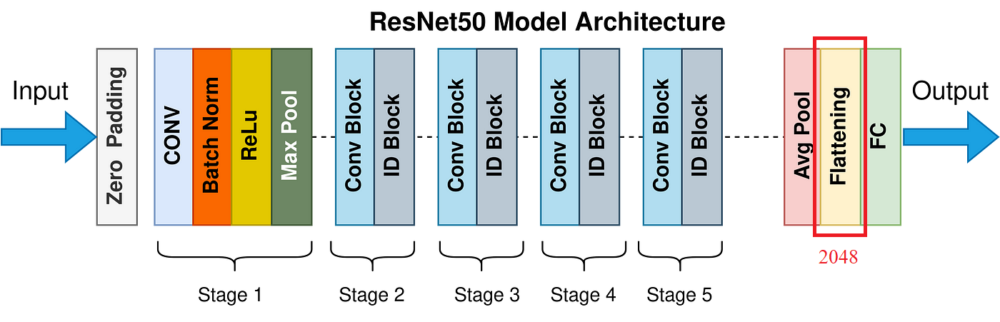

# ImageFinder

ImageFinder is a project that allows to find similar images based on the image provided.

## Parts of the repository
The repository is organized into 3 main components :
1. Download images : This part of the project involves downloading images based on information provided in a CSV file and storing them in a designated folder.
2. Embedding images : The downloaded images are processed through a neural network. The neural network converts each image from a matrix of dimensions (width x height x channels) to a single vector of size 2048.
3. API : The final component involves launching a server to host the API. This API accepts an image as input and returns the three most similar images from the dataset. The response includes the index and the distance of each similar image relative to the query image.

## How to use the code

### Installation
To install the necessary libraries for this project, run :
`pip install -r requirements.txt`

### Special Instructions for Windows Users
If you encounter the following error with `sqlite-vec` : 
`OperationalError: The specified module could not be found.`
You can manually download the required `.dll` file from this [link](https://github.com/asg017/sqlite-vec/releases/download/v0.0.1-alpha.37/vec0.dll) and place it in the directory specified by `sqlite_vec.loadable_path()`.

### Usage

1. Download images
Download images using a CSV file containing a list of URLs :
`python download_images.py --csv_file <path_to_csv>`

2. Embedding images
Convert the downloaded images to vectors and store them in an SQLite database for later retrieval :
`python extract_image_features.py --folder <path_to_images_folder>`

3. API
To run the server hosting the API with [Uvicorn](https://www.uvicorn.org/), use the following command:
`uvicorn main:app`
Or in a development environment to automatically reload the API when the underlying file is changed :
`uvicorn main:app --reload`

## Technical choices

### Embeddings
Converting an image's RGB matrix into a single vector (embedding) can be achieved in multiple ways, depending on the project's requirements.

-   **Efficiency and Low Computational Power:**
    
    -   Methods like SIFT (Scale-Invariant Feature Transform) are efficient for scenarios where the project needs to run on mobile devices or where quick results are necessary. These methods do not require significant computational power and still offer decent performance.

-   **High Performance:**
    
    -   For projects where performance is key and sufficient computational resources (e.g., GPUs) are available, Convolutional Neural Networks (CNNs) are more appropriate. CNNs can better capture the features of an image. In this project, we prioritize performance and use ResNet-50, a CNN with 23 million parameters. We remove the last layer of ResNet-50 to obtain a 2048-dimensional vector representing the image's features. ResNet-50 provides a balance between performance and efficiency, providing fast image retrieval with a relatively small number of parameters.

    

### Storage and retrieval
Once the embeddings are computed, they can be saved to formats like CSV or JSON. However, it is good practice to use specialized tools for storing vectors efficiently.
We use a SQLite database for robust storage and efficient querying of embeddings. The [sqlite-vec](https://github.com/asg017/sqlite-vec) extension improves SQLite with vector search capabilities. It uses brute force to find the closest vector in the database, which is efficient for our project's scope but with potential limitations with a large number of images. For faster vector search at the cost of some accuracy, Approximate Nearest Neighbor (ANN) techniques like Locality Sensitive Hashing (LSH) can be used to hash and group similar images into buckets.

### Vector comparison
To identify the most similar vectors, an appropriate comparison metric is needed. Common metrics include:

-   **L2 Distance:**
    
    -   Suitable when the magnitude of the vector is important. This is the only metric currently implemented in sqlite-vec.
-   **Cosine Similarity:**
    
    -   Useful when the direction of the vector is more significant than its magnitude. Although not yet implemented in sqlite-vec, it remains a valuable metric for many applications.

### API
We use [FastAPI](https://fastapi.tiangolo.com/), a fast and easy-to-use web framework, to build the API. FastAPI provides interactive documentation via SwaggerUI, simplifying the development and testing of API endpoints.